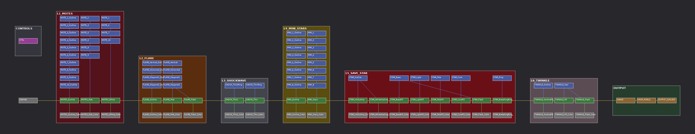

# Save Star (Determination) for DaVinci Resolve Fusion

`CastStarDetermination.setting` is the save-star cast effect rebuilt from Fusion's own nodes: no images, everything
is shapes, merges and expressions. One node, **CTRL**, controls the whole effect.

## Getting it into Resolve

1. Make the clip / timeline match the effect: **220 × 250**, **16 fps**, **24 frames** (frame 0 to 23).
   - In Resolve: a new timeline with custom resolution 220 × 250 at 16 fps, then add a **Fusion Composition**
     (Effects → Toolbox → Effects → Fusion Composition) 24 frames long and open it on the Fusion page.
2. Open `CastStarDetermination.setting` in any text editor, **select all, copy**, click in Fusion's **Nodes** panel
   and **paste** (Ctrl+V / Cmd+V). You can also drag the `.setting` file straight onto the Nodes panel.
3. Connect **OUTPUT_220x250** to **MediaOut1** (in standalone Fusion: add a **Saver** after it).
4. Press **Home** or **F** in the Nodes panel to frame everything.
5. Export with transparency: Deliver page → **PNG** image sequence (or QuickTime ProRes 4444) with
   **Export Alpha** ticked.

## How the graph is organised

- **CONTROLS** (top left): the **CTRL** node. Select it and everything is in the Inspector.
- One coloured box (underlay) per layer, left to right in drawing order:
  **L1_MOTES → L2_FLARE → L3_SHOCKWAVE → L4_MINI_STARS → L5_SAVE_STAR → L6_TWINKLE → OUTPUT**.
- Inside every box it reads the same way, top to bottom:
  1. **Blue nodes: shapes** (Rectangle / Ellipse / Polygon masks). The `_Outline` copies are 1 px bigger and give the
     dark outline.
  2. **Green nodes: merges** on the main chain that runs left to right through all the boxes.
  3. **Grey nodes: colours** (each merge has its own; they read the palette from CTRL).
- **OUTPUT**: `SHAKE` (screen shake) → `CRISP_PIXELS` (1-bit alpha) → `OUTPUT_220x250` (×2 nearest-neighbour).

The effect is built at **110 × 125** (one Fusion pixel = one art pixel) and scaled ×2 at the end, so it stays chunky
pixel art.

## The CTRL Inspector

| Section | Control | What it does |
|---|---|---|
| TIMING | Start Frame | first frame of the effect (everything is relative to it) |
| | Burst Frame | the frame the star bursts (default 7) |
| | Exit Frame | the frame the star starts popping away (default 15); the twinkle follows 4 frames later |
| LAYERS | 1 Motes … 6 Final Twinkle, Screen Shake | tick boxes to switch each layer on/off, great for seeing what each part does |
| LOOK | Star Size | resting star radius in art pixels (16.5) |
| | Burst Size | star radius on the burst frame (30) |
| | Motes Start Distance | how far out the motes start (36) |
| | Flare Length | half-length of the vertical flare ray (48) |
| | Shockwave Size | scale of both rings (0.85) |
| | Mini Stars Distance | how far the little stars fly out (28) |
| | Shake Strength | screen shake amount (1.5; 0 = none) |
| | Crisp Pixels | on: hard 1-bit edges like the game sprites. Off: smooth anti-aliased edges and real fades |
| PALETTE | Ink, Base, Light, Pale, White | the five colours. Change Base/Light/Pale for another class colour |

Moving **Burst Frame** or **Exit Frame** retimes everything that depends on them (flare, shockwave, mini stars,
shake, twinkle), because all the animation is expressions that read these values. No keyframes to move.

To tweak one layer by hand, open a shape node: its animated values are expressions (right-click a field →
*Remove Expression* to take over manually).

## Timeline at the default settings

| Frames | What happens |
|---|---|
| 0–6 | star pops in and grows, motes spiral in, breathing ring; star shivers on 5–6 |
| 7 | **burst**: white star (30 px), full cross flare, shockwave starts, shake |
| 8 | star outline flashes white, flare 3/4, mini stars pop out |
| 9–10 | star settles (15 → 17.5 px), flare 1/2 and 1/4 |
| 11–18 | mini stars drift and wink away one by one, shockwave fades |
| 15–18 | star swells and shrinks away |
| 19–22 | final twinkle (5, 9, 5, 2 px) |
| 23 | empty |

## What was checked, and what to look at first

This file was generated by `scripts/fusion/save_star.py` and has **not been tested inside DaVinci Resolve yet**.
What **was** checked:

- the file parses as a Fusion settings file (Lua table syntax), with all 101 nodes and 8 underlays;
- every node connection and every expression reference points at a node and control that exists, with no `&&`/`||`
  (Fusion expressions don't like them; nested `iif` is used instead);
- a simulation of the node maths matches the original animation frame for frame in timing and layout
  (`expected-look.gif`: original left, simulated Fusion comp right), with nothing touching the canvas edge
  and frame 23 empty.

If something looks off after pasting, these are the settings worth checking first:

| If… | Check |
|---|---|
| the star doesn't grow/shrink or rotate | on `STAR_Base` (and `TWINKLE_Star`, `MINI_1…8`), the polygon's **Center / Size / Z Rotation** controls should show expressions (purple). If your version names them differently, re-enter the expression from the table below |
| the final image is blurry | `OUTPUT_220x250` → **Filter Method** should be **Nearest Neighbor** |
| shapes look squashed or rings too thick/thin | mask **Width/Height** and **Border Width** are relative to the image width; tweak the LOOK sliders or the mask's Border Width |
| thin rings break up into dots | untick **Crisp Pixels**, or raise the ring's Border Width a little |

Star expressions, for reference (STAR_Base):

- Center: `Point(0.5 + CTRL.Shiver / 110, 0.504)`
- Size: `CTRL.ShowStar * CTRL.StarR / 16.5`
- Z Rotation: `CTRL.StarSpin`

To rebuild the file after changing the generator: `python3 scripts/fusion/save_star.py`.
